# Release architecture and maintainer guide

This project publishes `axum-observability` to crates.io without storing a
crates.io write token in GitHub. GitHub Actions authenticates through OpenID
Connect (OIDC), receives a temporary crates.io token, validates the reviewed
release tag, and publishes with Cargo.

This document describes the public release architecture and the steps a
maintainer follows. It intentionally contains no credentials, one-time
passwords, recovery codes, session data, or secret values.

## Architecture

```mermaid
flowchart LR
    A[Reviewed release change merged to main] --> B[Annotated tag vX.Y.Z]
    B --> C[Publish GitHub Release]
    C --> D[GitHub Actions release workflow]
    D --> E[GitHub Environment crates]
    E -->|Short-lived OIDC identity| F[crates.io trusted publisher]
    F --> G[Temporary crates.io token]
    G --> H[cargo publish]
    H --> I[Public crate and docs.rs build]
```



The release boundary has five parts:

1. **Reviewed source and annotated tag:** Version metadata, changelog, code, and
   documentation are merged first. An annotated `vX.Y.Z` tag points to that
   exact reviewed commit on `main`.
2. **GitHub Release:** Publishing a stable GitHub Release for the existing tag
   triggers the workflow. A standalone tag push does not publish the crate.
3. **GitHub Environment:** The publish job uses Environment `crates`, restricted
   to selected `v*` tags. It contains no crates.io credential.
4. **GitHub OIDC and crates.io trusted publisher:** The job receives
   `id-token: write` permission. `rust-lang/crates-io-auth-action` exchanges the
   GitHub identity for a temporary crates.io token and automatically revokes it
   in the action's post step.
5. **Cargo publication:** `cargo publish --locked` uploads the package from the
   validated release checkout. crates.io versions are permanent and cannot be
   overwritten.

crates.io is configured to require trusted publishing for every new version.
There is no long-lived API-token fallback. A local maintainer token was used
only for the one-time v0.1.0 bootstrap and was revoked after publication.

## Public release configuration

| Setting | Value |
| --- | --- |
| crates.io package | `axum-observability` |
| Package registry | `crates-io`, enforced by `Cargo.toml#package.publish` |
| GitHub repository | `janisto/axum-observability` |
| GitHub owner ID | `387868` |
| Workflow | `.github/workflows/release.yml` |
| Trusted-publisher workflow name | `release.yml` |
| GitHub Environment | `crates` |
| Runner | GitHub-hosted `ubuntu-latest` |
| Workflow trigger | GitHub Release `published` |
| Published release type | Stable `vX.Y.Z` only; prereleases are skipped |
| Authentication | `rust-lang/crates-io-auth-action` |
| Publish command | `cargo publish --locked` |
| crates.io policy | Require trusted publishing for every new version |
| Release notes | GitHub-generated and maintainer-reviewed |
| Stable GitHub Release label | `Latest` |

The crates.io trusted-publisher form uses the workflow filename `release.yml`,
not the full `.github/workflows/release.yml` path. Repository owner, repository,
workflow filename, and Environment are case-sensitive identity inputs.

Before the first trusted release, and after changing the repository owner or
name, workflow filename, Environment, or package repository metadata, reopen
the crates.io publisher settings and verify them against this table. A mismatch
surfaces only when the workflow requests a token.

The workflow must remain on a GitHub-hosted runner. Do not add
`CARGO_REGISTRY_TOKEN`, a repository secret, a personal API token, or an
interactive `cargo login` step.

## What the workflow does

The **Publish to crates.io** job performs this sequence:

1. checks out the explicit GitHub Release tag with full history and without
   persisting Git credentials;
2. requires a stable `vX.Y.Z` tag and verifies that it is an annotated Git tag;
3. verifies that dereferencing the tag produces the checked-out commit and that
   the commit belongs to `origin/main`;
4. installs Rust 1.96.1 with `rustfmt` and Clippy;
5. reads package metadata with locked Cargo resolution and requires the package
   version to match the release tag exactly;
6. runs formatting, Clippy with warnings denied, all targets and features,
   rustdoc with warnings denied, `cargo package --locked`, and
   `cargo publish --dry-run --locked`;
7. requests a temporary token from crates.io using GitHub OIDC only after every
   validation step succeeds; and
8. publishes with `cargo publish --locked`, after which the auth action revokes
   the temporary token.

The release event is the authorization boundary. The workflow does not run for
a tag push alone, and its publish job skips a GitHub Release marked as a
prerelease. The current tag validator accepts stable SemVer only. Adding a
prerelease channel requires a separately reviewed workflow and release-policy
change; do not bypass the guard manually.

The workflow deliberately verifies the release checkout again even though the
same commit passed pull-request CI. Hosted PR checks prove the reviewed source;
release checks prove the immutable version/tag relationship and package at the
publication boundary.

## Maintainer release guide

### 1. Prepare the version

Create a normal review branch and:

1. update `Cargo.toml#package.version`;
2. refresh `Cargo.lock` through Cargo when the package metadata requires it;
3. add the release date and user-visible changes to `CHANGELOG.md`;
4. update rustdoc, README content, examples, and structured-field documentation
   when public behavior changes; and
5. confirm that the declared Rust version and dependency policy remain correct.

Do not create the Git tag during version preparation. Version, changelog, code,
tests, and documentation must be reviewed together.

### 2. Run the release checks

From the exact clean candidate commit:

```bash
just install
just qa
just package-check
cargo publish --dry-run --locked
actionlint .github/workflows/ci.yml .github/workflows/release.yml
git diff --check
git status --short
```

`git status --short` must print nothing. Never use `--allow-dirty` or
`--no-verify` for a release candidate.

`just qa` runs formatting, Clippy with warnings denied, all tests and examples,
doctests, dependency policy, and the RustSec audit. `just package-check` creates
the `.crate` archive, permits only the manifest's public file set, enforces the
crates.io size boundary, compiles Cargo's extracted package, and runs an
isolated consumer against that packaged source.

Inspect and hash the candidate archive:

```bash
VERSION="$(cargo metadata --locked --no-deps --format-version 1 |
  jq -er '.packages[] | select(.name == "axum-observability") | .version')"

cargo package --locked --list
tar -tzf "target/package/axum-observability-$VERSION.crate"
shasum -a 256 "target/package/axum-observability-$VERSION.crate"
```

The archive must contain only the reviewed library source, examples, package
metadata, README, changelog, example guide, and license. It must not contain
tests, plans, credentials, local output, maintainer-only guides, coverage
reports, or mutation artifacts.

Merge the release preparation through a green pull request to `main`.

### 3. Create the annotated tag and draft release

Fetch `main`, identify the exact reviewed commit, and verify the version again:

```bash
git fetch origin main
TARGET="$(git rev-parse origin/main)"
VERSION="$(cargo metadata --locked --no-deps --format-version 1 |
  jq -er '.packages[] | select(.name == "axum-observability") | .version')"

test "$(git rev-parse HEAD)" = "$TARGET"
test -z "$(git status --porcelain)"
```

Create and push an annotated tag at that exact commit:

```bash
git tag -a "v$VERSION" "$TARGET" -m "v$VERSION"
git push origin "v$VERSION"
```

Do not use a lightweight tag. The release workflow deliberately checks the Git
object type before requesting a publisher token.

Create a draft GitHub Release from the existing tag:

```bash
gh release create "v$VERSION" \
  --verify-tag \
  --title "v$VERSION" \
  --generate-notes \
  --latest \
  --fail-on-no-commits \
  --draft

gh release view "v$VERSION" --web
```

Review the generated previous tag, merged pull requests, contributors, and
full-changelog link. Edit only for accuracy and clarity; the user-visible notes
must agree with `CHANGELOG.md`. Verify the existing tag, target commit, title,
notes, stable-release status, and **Latest** selection before publishing.

### 4. Publish and monitor

Publish the unchanged stable draft and explicitly preserve its Latest label:

```bash
gh release edit "v$VERSION" --draft=false --latest
```

Publishing the GitHub Release triggers the OIDC workflow. Open or watch it:

```bash
gh run list --workflow release.yml --event release --limit 5
gh run watch <run-id> --exit-status
```

The **Publish to crates.io** job must finish successfully. Confirm that tag
type, exact checkout, `main` ancestry, Cargo version, format, Clippy, tests,
rustdoc, package verification, publish dry-run, OIDC authentication, and final
publication all passed. The run must not request a personal token or
interactive credential.

### 5. Verify the public release

Check the GitHub Release and annotated tag:

```bash
gh release view "v$VERSION" \
  --json tagName,name,url,isDraft,isPrerelease,publishedAt,targetCommitish

gh api "repos/janisto/axum-observability/git/ref/tags/v$VERSION" \
  --jq '.object.type + " " + .object.sha'
```

The tag reference must identify a `tag` object, not a commit. Dereference the
annotated tag and require the reviewed commit:

```bash
TAG_OBJECT="$(gh api \
  "repos/janisto/axum-observability/git/ref/tags/v$VERSION" \
  --jq .object.sha)"

gh api "repos/janisto/axum-observability/git/tags/$TAG_OBJECT" \
  --jq '.object.type + " " + .object.sha'
```

Read back the crates.io version metadata:

```bash
curl -fsSL \
  "https://crates.io/api/v1/crates/axum-observability/$VERSION" |
  jq -e --arg version "$VERSION" '
    .version.num == $version and
    .version.yanked == false and
    .version.crate == "axum-observability"
  '
```

Download the public archive, compare it with the registry checksum, and inspect
its file set:

```bash
ARCHIVE="/tmp/axum-observability-$VERSION.crate"
METADATA="$(curl -fsSL \
  "https://crates.io/api/v1/crates/axum-observability/$VERSION")"
CHECKSUM="$(printf '%s' "$METADATA" | jq -er .version.checksum)"

curl -fsSL \
  "https://crates.io/api/v1/crates/axum-observability/$VERSION/download" \
  -o "$ARCHIVE"

test "$(shasum -a 256 "$ARCHIVE" | awk '{print $1}')" = "$CHECKSUM"
tar -tzf "$ARCHIVE"
```

Compile a fresh registry-backed consumer without a path dependency:

```bash
TEMPORARY="$(mktemp -d)"
cargo new --bin "$TEMPORARY/consumer"
cargo add --manifest-path "$TEMPORARY/consumer/Cargo.toml" \
  "axum-observability@=$VERSION" \
  "axum@=0.8.9"
cargo check --manifest-path "$TEMPORARY/consumer/Cargo.toml" --locked
```

Finally, verify that:

- the crates.io package page shows the released version, README, license,
  repository, Rust version, and expected dependencies;
- the public archive checksum and contents match the registry metadata;
- docs.rs successfully builds and renders the exact version;
- the GitHub Release tag dereferences to the reviewed `main` commit;
- a stable GitHub Release carries the **Latest** label;
- `cargo search axum-observability` and the crates.io index expose the version;
- the changelog, release notes, rustdoc, and published behavior agree; and
- the repository remains clean after verification.

After functional v0.2.0 passes every verification, migrate
`axum-playground` against exact registry version `=0.2.0`. Do not use a path or
Git dependency as a pre-publication proof.

## Failure and recovery

- **OIDC authentication fails:** Verify the crates.io trusted publisher's
  case-sensitive owner, repository, workflow filename, Environment, and owner
  ID. Confirm that the job runs on GitHub-hosted infrastructure with job-level
  `id-token: write`. Do not add a token fallback.
- **The workflow fails before upload:** First confirm that crates.io has no
  version record. A purely transient run may be retried against the unchanged
  release and tag. A source, metadata, or workflow correction requires a new
  reviewed version; do not move a published release tag.
- **Cargo reports an index polling timeout after upload:** The upload may still
  have succeeded. Check the version API, crate page, index, and archive before
  retrying. Never assume timeout means absence.
- **crates.io already contains the version:** Stop. Published versions cannot be
  overwritten. Verify whether the existing archive is the intended release and
  never retry with different bytes.
- **The public crate is defective:** Yank it when appropriate and publish a
  corrected higher version. Yanking prevents new resolution but does not delete
  the archive or break existing lockfiles.
- **docs.rs fails:** Publication may still be complete. Inspect the docs.rs
  build log. A source or metadata correction requires a higher version; never
  rewrite the published crate.
- **GitHub and crates.io disagree:** Treat the release as incomplete. Preserve
  the public evidence, identify which boundary failed, and reconcile through a
  new reviewed version rather than rewriting history.
- **A temporary token remains after a cancelled job:** Inspect the workflow and
  crates.io token list. The auth action's post step normally revokes the token;
  revoke any unexpected credential immediately and investigate before another
  release.

## Bootstrap history

v0.1.0 was a one-time, dependency-free bootstrap used to establish the
crates.io package record. crates.io requires an existing crate before a trusted
publisher can be configured, so that version was published manually with a
short-lived API token. The token was removed locally and revoked after the
registry archive, checksum, docs.rs page, GitHub Release, and external consumer
were verified.

v0.2.0 is the first functional middleware release and the first version
published through this OIDC architecture. The bootstrap remains visible in Git
and registry history; release notes must never describe v0.1.0 as functional.

## Official documentation

- [crates.io trusted publishing](https://crates.io/docs/trusted-publishing)
- [`rust-lang/crates-io-auth-action`](https://github.com/rust-lang/crates-io-auth-action)
- [Cargo: Publishing on crates.io](https://doc.rust-lang.org/cargo/reference/publishing.html)
- [`cargo package`](https://doc.rust-lang.org/cargo/commands/cargo-package.html)
- [`cargo publish`](https://doc.rust-lang.org/cargo/commands/cargo-publish.html)
- [Cargo SemVer compatibility](https://doc.rust-lang.org/cargo/reference/semver.html)
- [GitHub OIDC](https://docs.github.com/en/actions/reference/security/oidc)
- [GitHub deployment environments](https://docs.github.com/en/actions/concepts/workflows-and-actions/deployment-environments)
- [GitHub Release workflow events](https://docs.github.com/en/actions/reference/workflows-and-actions/events-that-trigger-workflows#release)
- [`gh release create`](https://cli.github.com/manual/gh_release_create)
- [`gh release edit`](https://cli.github.com/manual/gh_release_edit)
- [GitHub releases](https://docs.github.com/en/repositories/releasing-projects-on-github)
